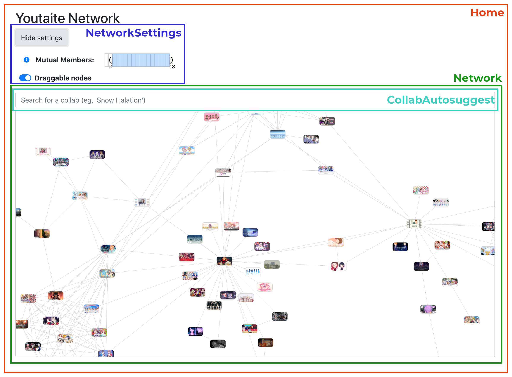

# Youtaite Network

## Front end

The front end of the website is written using [React.js](https://reactjs.org/), with [D3.js](https://d3js.org/) for the data visualization.

### Data visualization

#### Components

#### Interaction

### Submission form

#### Components

## Back end

### Database structure

#### Auditing

### API integration
