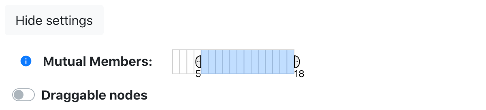

## Summary

Find the deployed website at [youtaite-network.netlify.app/](https://youtaite-network.netlify.app/).

This is a project focused on a community of Youtube content creators who often collaborate with each other. I wanted to show how different collaborations are connected to each other through people - for example, if I am in two different collabs, those two collabs are connected through me. I hope to show the existence of different corners within the community, where groups of people collaborate with each other more often than with someone outside of their corner. I have a lot of other ideas for creatively displaying the data (once I have enough of it), such as organizing by the "strength" of a connection, restricting time ranges, and identifying closely-related clusters and "representative" collaborations of those clusters. The frontend website is written in [React.js](https://reactjs.org/), with [D3.js](https://d3js.org/) for the data visualization. The backend API is written in Ruby on Rails.

## Home page and data visualization

### Components


#### Home

Home is a hook component that uses [axios](https://www.npmjs.com/package/axios) to fetch data and store it in a state variable. It also wraps the Network and NetworkSettings components. When a setting is changed in NetworkSettings, it calls a function in the Home component that sets a corresponding state variable. This state variable is given to Network as a prop, which triggers the network to update.

```jsx
// Home.jsx
const [drag, setDrag] = useState(true);
// ...
return (
  <div className="container mt-3">
    <h2>Youtaite Network</h2>
    <NetworkSettings setDrag={setDrag} setRange={setRange} />
    <Network dragProp={drag} rangeProp={range} />
  </div>
);
```

#### NetworkSettings



NetworkSettings is a hook component. It contains two important settings for changing the view of the network. The first is called "mutual members", and represents the number of members in common between two collabs that must exist for a link to be displayed. If mutual members has the range 3-10, then only collabs with 3-10 members in common between them will be linked together. In general, moving the lower bound up becomes more useful as more collabs are entered into the database. Without this feature, the network would quickly become messy and difficult to understand. The second setting is the ability to enable and disable draggable nodes. This is useful particularly on mobile, where draggable nodes might get in the way when the user might be trying to pan the network instead.

The mutual members range slider is implemented using [d3-brush](https://github.com/d3/d3-brush). The following code demonstrates the slider's logic, which is adapted from [this code example](https://observablehq.com/@sarah37/snapping-range-slider-with-d3-brush).

```js
// NetworkSettings.jsx
const brush = d3.brushX()
  .extent([[x, y], [x + width, y + height]])
  .on('brush', function (event) {
    selection = event.selection;
  })
  .on('end', function (event) {
    const s = selection;
    const d0 = s.map(xScale.invert);
    const d1 = d0.map(Math.round);
    d3.select(this).transition().call(event.target.move, d1.map(xScale));
    // update view
    d3.select('#slider-event-handler').dispatch('change', { detail: { range: d1 } });
  });
```

When the `brush` event is triggered, we set the `selection` variable, which is the current range that has been selected (defined in pixels). When the `end` event is triggered, we convert this selection into the actual range using a linear [scale](https://github.com/d3/d3-scale). Then we round the lower and upper bounds and call the `move` event on the brush with the new rounded values. Finally, we dispatch a custom event, which is handled by calling the `setRange` function, passed down from the `Home` component (as described above).

```js
// NetworkSettings.jsx
d3.select('#slider-event-handler')
  .on('change', (event) => {
    setRange(event.detail.range);
  });
```

#### Network


Network is a hook component that uses D3's [force-directed layout](https://github.com/d3/d3-force) to display the graph. 

```js
// Network.jsx
const simulation = d3.forceSimulation()
  .force('charge', d3.forceManyBody().strength(-600))
  .force('link', d3.forceLink().id((d) => d.id).distance(50))
  .force('x', d3.forceX())
  .force('y', d3.forceY())
  .force('center', d3.forceCenter().x(w / 2).y(h / 2))
  .on('tick', ticked);
```

The graph contains two types of nodes: one represents videos, or collabs; the other represents people. Collab nodes are represented as rectangles, while person nodes are represented as circles. In the initial view of the network, no person nodes are visible. However, when a collab node is clicked, a "closeup" view of that node is provided that shows the people who are directly connected to that node.

When the network is created, first, the svg is attached to the DOM. Then, empty groups are created for edges, person nodes, and collab nodes. We define a `ticked` function which handles node and edge movement over time; a `zoomed` function that handles user interaction through zooming and panning; and a `dragNode` function that handles user interaction through dragging nodes.

Finally, we define an `update` function updates the network. The first step of `update` is to get the graph components that should be currently displayed, based on current node and edge data (stored in refs to avoid stale state):

```js
// Network.jsx
const currentGraphComponents = getCurrentGraphComponents(
  dataset.current, rangeCollabs.current, rangeEdges.current, focusedNode.current,
);
```

Using D3's [data join](https://observablehq.com/@d3/selection-join), we then bind the new data to nodes and edges. For collab nodes, this is done as follows (person nodes and edges are implemented similarly):

```js
// Network.jsx
collab = collab
  .data(collabs.current, (d) => d.id)
  .join((enter) => {
    enter = enter.append('g')
      .classed('collab', true)
      .attr('id', (d) => `g-${d.id}`)
      .on('mouseover', /* mouseover event handler */)
      .on('mouseout', /* mouseout event handler */)
      .on('click', /* click event handler */);
    // omitted: clipPath, image, and rect are appended to each group to configure node appearance
    return enter;
  });
```

The mouseover, mouseout, and click event handlers handle user interaction with individual nodes. When a user mouses over a node, that node, as well as any connected edges and nodes, are given an `active` class, and corresponding style changes are handled in the CSS. When a user mouses out of a node, all nodes and edges have the `active` class removed.

When a user clicks a collab node, the view changes to show that collab node, any directly connected collab nodes and edges, and the person nodes that connect the clicked node to other collab nodes. The collab node that was clicked is stored in a ref called `focusedNode`. At the end, the network is updated to reflect these changes to the graph. This process is implemented as follows:

```js
// Network.jsx
if (focusedNode.current) {
  // unfix currently selected node
  focusedNode.current.fx = null;
  focusedNode.current.fy = null;
}
// focus/fix clicked node
focusedNode.current = node;
node.fx = node.x;
node.fy = node.y;
// change force center
simulation.force('center', d3.forceCenter().x(node.fx).y(node.fy));
network.current.update();
```

#### CollabAutosuggest


CollabAutosuggest is a hook component that uses the [react-autosuggest](https://github.com/moroshko/react-autosuggest) package to automatically suggest collabs (based on the collab's video title) as the user is typing. To do this, the user input is cleaned up and checked against each collab's title. Currently suggested collabs are kept in a state variable.

```js
const suggestValue = value.replace(/[ \t\n.]/g, '').toLowerCase();
const newSuggestions = suggestValue.length === 0 ? [] : allCollabs.filter((collab) => collab.title.replace(/[ \t\n.]/g, '').toLowerCase().includes(suggestValue));
setSuggestions(newSuggestions.slice(0, 20));
```
